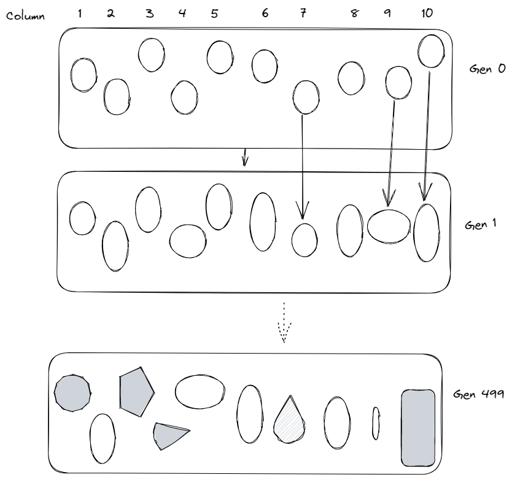
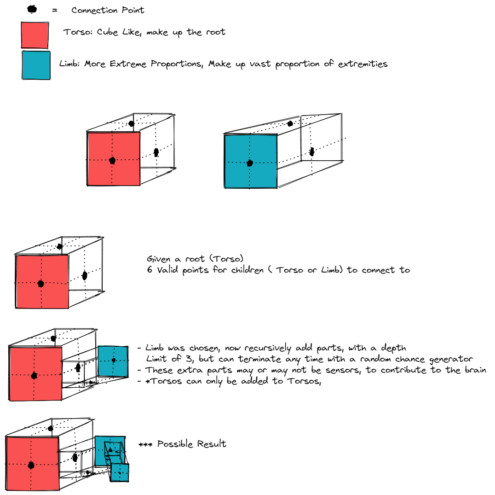
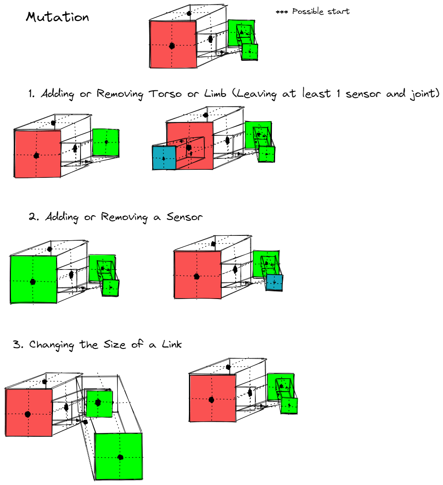
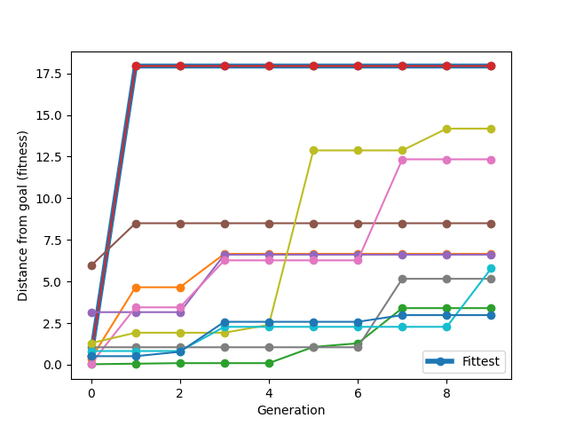

# ArtificialBots-1.0- [ArtificialBots-1.0](#artificialbots-10)
- [ArtificialBots-1.0- ArtificialBots-1.0](#artificialbots-10--artificialbots-10)
  - [Running the Code](#running-the-code)
  - [How Evolution Works](#how-evolution-works)
  - [How Generation Works](#how-generation-works)
  - [How Mutation works](#how-mutation-works)
  - [In Practice (Unevolved -\> Evolved)](#in-practice-unevolved---evolved)
  - [Fitness Function](#fitness-function)
  - [How to play around](#how-to-play-around)
  - [No Time? No Problem!!](#no-time-no-problem)
  - [Results](#results)
  - [Required Pip Installs](#required-pip-installs)
  - [Credits and other repositories](#credits-and-other-repositories)

Repository to hold assignments for LudoBots in my Artificial Life Course at Northwestern University

## Running the Code
1. Start by modifying the parameters of the evolutionary algorithm that you would like to set in the `constants.py` file in the main directory
  Points of Interest
    - Seed: Results will in theory bee the same, for the first generation unless this is changed
    - Torso/Limb Size Min and Max
    -  Torso/Limb Ratio: This changes how extreme the proportions are allowed to be on generation. 
    -  *** Be careful modifying these values as it may cause runtime to increase or bofy generation to be impossible
2. Train generations with `python search.py` when the constants are upto standard
   1. If errors arise, it is because the parameters were not not possible to implement
3. View trained generations with the `python loader.py` program
   1. Parameters are as such `python loader.py {generationFileName} *{best | print | graph | {**colNumber}} `
   2. *: This is an optional parameter, but highly recommended. if unused, it will display all the bodyies in that generation
   3. **: This is the number of the column/body given, if you are unsure of what you want to display, use `print` and it will display all of the columns and their fitness highlighted in white text for ease of access. If you are confused about the term column number, it is referenced in the algorithm used for evolution in the [How Evolution Works](#how-evolution-works) section.
   4. BEST - Shows best within this generation and prints its name and fitness
      1. python loader.py seed100/generation499 best
   5. Print - Prints alls name and fitness within the Generation
      1. python loader.py seed100/generation499 print
   6. graph - Shows the fitness curve for this generation up until that point, that means that using it on the most recent generation would give you the overall fitness curve
      1. python loader.py seed100/generation499 graph
   7. **colNumber - works similar to `best` but for a specific column number. It is just an integer
      1. python loader.py seed100/generation499 1

This way of running and loading was used to save time, also makes it really fun to play around with, hope you have fun!

**To run code, use the command `python search.py` in terminal**
You may need to use `python3` instead

[Video Demonstration](https://youtu.be/-SnFG_7EwTQ)
Example diagram for evolution shown in video as well

## How Evolution Works

**Evolution Algorithm: Hill Climbing**

This is done by using separated, one to one evolution as seen above,  starting from a set of procedurally [generated](#how-generation-works) bodies, represented by the generation 0, they will have offspring, which will be a [mutated](#how-mutation-works) version of itself. 
The code for this is 

## How Generation Works

This is what is done by the `randombody.py` class. It makes use of collisiondetection and linear algebra to efficiently and reliably make bodies that can be added upon

The encoding of the body is a direct mapping, using a tree structure of the torsos and limbs, with the root as described in the image. 

## How Mutation works

## In Practice (Unevolved -> Evolved)

## Fitness Function
Distance from starting Point as fast as possible
Sensing body parts are labeled by being green, while standard parts are a familiar cyan.

## How to play around
The `constants.py` file has some features that can be played with. Since the snake is procedurally generated, you can minmax the features of the body.
For now the snakes use a random 3d section of a cube with size that can be set in the constants. Functionality will be added later to support seeds and 
recursive body part creation for 3D generations of creatures.

If the code stops running due to permission errors, just rerun the code, this is an issue with OS not updating
permissions on time in the middle of runtime, so not much can be done.

## No Time? No Problem!!
In the GitHub Repository has multiple seeds and generations ready to go. Just use the `loader.py` as needed to see results of trained bodies

## Results
Mutations were often very beneficial. What i found intriguing was that many times, removal of links was more beneficial. The overall changes made the most difference in the ability to balance. I believe this is because the mutations require less generations to get used to a body if it has less links. This is also a challenge that I want to overcome. 

The results are clear and show ability to gain distance from the starting point
To verify, use the loader, results should look as follows

## Required Pip Installs
Python 3.10 and up is required
 1. Numpy
 2. pybullet (Ludobots Reddit below details installation instructions)
 3. termcolor
 4. matplotlib

## Credits and other repositories

 1. [LudoBots Reddit by DoctorJosh](https://www.reddit.com/r/ludobots/wiki/installation/)
 2. [Pyrosim Repo (Github)](https://github.com/jbongard/pyrosim)
    

